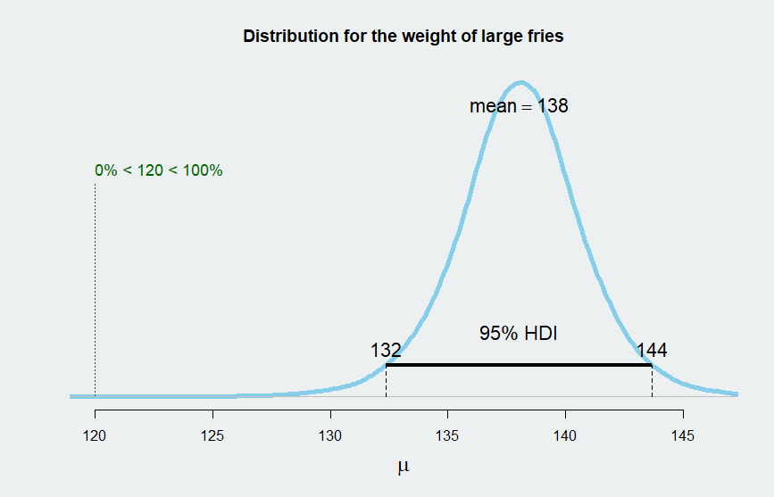

```{r setup, include=FALSE}
library(knitr)
library(kableExtra)

knitr::opts_chunk$set(echo = TRUE)
```

## Background

I was curious if the weight of fries at McDonalds are under their recommended serving size. To test this I obviously purchased some fries and weighed them. The weight was compared to the serving size using Bayesian estimation (here is a [walkthrough](https://haututu.github.io/JBlog/mcdfries/) for those interested).

It seems no one has reported on this besides a [Herald article](http://www.nzherald.co.nz/food/news/article.cfm?c_id=206&objectid=10707888) I found where they counted the number of fries between medium and large. They didn't over analyse the heck out of it anywhere near as much as we have here.

## The details

Checking on the McDonalds website the serving size is 120g for a large fries and off the bat, it seems the weights I observed were quite a bit above that with an average weight of 138g. Infact, as we can see in the distribution below, there is less than a 1% chance that the average weight is equal to or less than 120g. Even our 95% confidence interval is quite high sitting between 132g and 144g (it's labelled HDI which is a Bayesian equivelant).



## Conclusion

No need to fear that we are getting ripped off with our large fries (at least for the McDonalds tested). However, if you for some reason care about the calories then on average you are consuming 60 calories more than advertised based on a rough calculation.

I can sleep easy knowing Im getting my moneys worth but an interesting next step would be to investigate reliability between stores and between medium/large fries.

As a final note, the method behind this is a pretty straight forward example of Bayesian estimation so anyone interested in the data side should take a look at the [full](https://haututu.github.io/JBlog/mcdfries/) write up.